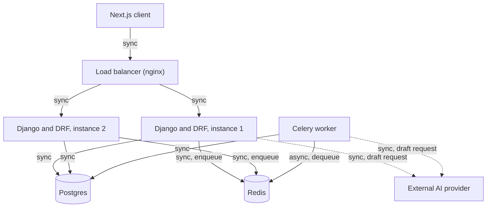

# Member Callout Design

## Requirements

### What I am building

A way for local leadership to send an emergency notice to some or all of their members, know how many actually saw and acknowledged it before a callout, and be certain that a local's member data, and a member's ability to act, never crosses into another local's territory. The system has to survive a member being off the network for hours or days, and a retried or restarted send cannot reach the same person twice.

### Assumptions

Denise's message does not specify the following, so here is what I am building against.

**Scope.** The design targets all 43 locals and 187,000 members, the numbers given in the brief. Local 27 is the only tenant that gets used and seeded for the build slice.

**What "immediately" means.** Best effort delivery within seconds for devices that are online, with the notice queued and flushed the moment an offline device reconnects. This is not a guarantee, since 5 to 10 percent of push notifications silently fail and some members are unreachable for days.

**Whether RSVP is required.** Optional, not enforced. I cannot compel a mandatory response from someone who is off grid. Instead I track delivered, read, and acknowledged state so Denise gets an honest headcount rather than a false one.

**What counts as done.** A callout is considered resolved at the meeting's scheduled time, not at 100 percent delivery, since full delivery may never happen. The counts stay visible as a snapshot after that point.

### Concern worth flagging

Denise's question about apprentice contact info is not a minor onboarding cleanup item. If it is true that members outside her local can see it, then one local's member data is already reachable from outside that local, which is exactly what Rule 1 exists to prevent. I am treating this as a real access control defect to design against from the start, not as a hypothetical.

### Questions I would ask Denise

Since this is not a live channel, each question below is followed by the assumption I made instead.

1. Is RSVP confirmation required before a callout, or is it just useful to have?
   Assumed optional and informational, since mandatory response cannot survive members being legitimately offline.

2. Does "everyone" in a callout ever mean sending across multiple locals at once?
   Assumed no. A callout is scoped to one local by default, optionally narrowed by classification. Cross local broadcast is out of scope for this exercise.

3. What delivery latency actually counts as acceptable, given that some members are offline for days?
   Assumed that online devices are notified within a best effort window of seconds, and that a notice counts as delivered once the device has actually received it, however long that takes.

## Design

### 1. Data model

The starting schema is missing two things on purpose: a way to tell a leadership account from a member account, and a place to record what each recipient actually did with a message. Both additions below are small changes to the given tables, not a rewrite.

```
locals
    id, name

members
    id, local_id, full_name, email, classification, status, role

announcements
    id, local_id, title, body, needs_ack, sent_at, created_at, request_id

announcement_recipients (new)
    id, announcement_id, member_id, delivery_status, sent_at, read_at, acknowledged_at, rsvp, rsvp_updated_at
```

`role` on members is `member` or `leadership`. A leader is still tied to one local and shares every field a member has, so a flag on the existing table avoids a second table and an extra join on every permission check. A separate leadership table was rejected for that reason.

`request_id` on announcements is a value the client generates once per create attempt, unique per local. It exists so a retried create request is recognized as the same request instead of producing a second announcement, which matters for Rule 2 and is explained fully in section 3.

`announcement_recipients` is the table that answers Denise's actual question. `delivery_status` and the three timestamp columns record whether a member has done nothing, been sent the message, read it, or acknowledged it. `rsvp` is a fixed three value field, `coming`, `cant`, or `no_response`, rather than free text or a boolean, because a boolean cannot separate an explicit decline from silence, and a fixed value keeps a headcount query a single indexed count instead of a text search. The pair of `announcement_id` and `member_id` is unique, which is what Rule 2 rests on.

### 2. The send path

When leadership presses Send, the request that hits the server does three things and nothing else: check that the caller is authenticated leadership for that local, validate the title and body, and insert one row into announcements with `sent_at` set. It then hands off a background job with the new announcement's id and returns. That whole path targets well under a second, regardless of whether the audience is twenty members or 22,400, because the request never touches a recipient row.

Everything involving the 22,400 phones happens after the response, in a worker. The worker looks up the active members for that local, optionally narrowed by classification, and inserts one `announcement_recipients` row per member in batches of about a thousand, using the same conflict safe insert described in section 3. As each batch lands, it hands the member ids in that batch to a dispatch step that calls the push provider and marks each row sent or failed. None of this blocks leadership's screen, which already has its response.

A member who is offline for hours or days is not treated as a delivery failure. The push provider holds a notification for an offline device and delivers it once the device reconnects, so a row can sit at `sent` for a long time before it becomes `read`, and that is expected, not broken. `failed` and `undeliverable` are reserved for the roughly 5 to 10 percent of sends the brief calls out as silently dropped by the provider itself, not for members who are simply out of range. Those rows are swept and retried once, a few minutes later, before being left as a final failure the status screen can show Denise. This is the one part of the design that is intentionally light. A single retry catches most transient provider errors without turning the worker into a second delivery system, and going further, for example a second channel like SMS for anything still failed, is called out under what I cut rather than built here.

For the status screen, four people watching sent, read, and acknowledged counts refresh every few seconds is a real load risk if each refresh runs a fresh count query against 22,400 rows. The counts are instead recomputed once, by the worker, after each batch, and cached for a few seconds. The status endpoint reads that cached value first and only falls back to a live query if the cache is empty. A few seconds of staleness on a number nobody is acting on faster than that is an acceptable trade for not building a live push channel to the browser, which was the alternative rejected here. A live channel would need a persistent connection layer this exercise does not otherwise call for, for a number that only needs to be roughly current, not exact to the second.

### 3. The two rules, by design

Rule 1 is enforced at one place: a base viewset that every endpoint touching local scoped data must inherit from. That base class filters every query by the caller's own `local_id` before anything else runs, and a second base class layers a permission check requiring `role` equal to `leadership` for actions only leadership should reach. A new endpoint is only unsafe if whoever writes it skips those base classes and talks to the model directly, which is a visible choice in a diff, not a forgotten line buried inside a view. Checking `local_id` by hand inside each view was rejected, since that depends on every future author remembering to add it, which is exactly the failure mode the brief warns about.

Rule 2 rests on two constraints, not application logic. The pair of `announcement_id` and `member_id` is unique on `announcement_recipients`, and the worker inserts recipient rows with an insert that does nothing on conflict rather than checking for existence first. That means a worker that crashes after batch forty of ninety can simply restart from batch one. The batches it already wrote are silently skipped by the constraint, and the remaining batches proceed as normal, so a restart is safe without needing to know where it left off.

That covers a restarted worker, but not a retried request from leadership, since a second identical POST would otherwise create a second announcement with its own id, which the recipient constraint cannot see as a duplicate of the first. That is why `request_id` from section 1 exists: the create endpoint treats a repeated `request_id` for the same local as the original request, not a new announcement, so a retried send never reaches the fan out step twice in the first place.

Finding out either rule had already broken does not require reading code. For Rule 1, since access is always scoped by the base viewset, a leak can only happen through a query that bypasses it, so a periodic join of `announcement_recipients` back to its announcement's `local_id` and its member's `local_id`, checking for any row where the two differ, catches it after the fact. For Rule 2, a query grouping `announcement_recipients` by `announcement_id` and `member_id` and checking for a count above one should always return nothing while the constraint is in place, so the practical signal in production is a unique violation appearing in the database logs, not a scheduled query that is expected to stay empty.

### 4. A diagram



Two Django instances sit behind nginx so the devops bonus, hitting either instance at random, has something to hit. The worker is the only path that ever writes 22,400 recipient rows, and it talks to Postgres directly, the same database the two Django instances use, so the unique constraint from section 3 holds no matter which instance took the original request. The AI call is drawn as synchronous from whichever process makes it, because the exercise asks what happens when the provider is slow or down, and the answer is a timeout, not a queued retry, falling back to a manual draft.

The diagram shows one worker, which is a starting point, not a ceiling. Rule 2 is enforced by the unique constraint on `announcement_recipients`, not by anything the worker holds in memory, so running several workers against the same Redis queue needs no change to this design. The same is true of the two app instances, both already talk to the same Postgres and the same Redis, so a third or fourth instance behind nginx is a deployment change, not a design change.

## What I cut

**A second delivery channel.** A row that is still `failed` after one retry stays `failed`. I did not design a fallback channel, such as SMS, for members the primary push provider cannot reach at all. For this exercise, one retry against the same channel is the honest line between a real fix and scope creep, but it means a small number of members can still be missed with no automatic backup.

**RSVP.** Modeled in the data model and enforced nowhere in the build, per the brief: it is design only for this exercise. The `rsvp` field and its three states exist on `announcement_recipients` and are visible in the seeded data, but there is no endpoint for a member to set it.

**A member facing screen.** Optional per the brief. The member side is an endpoint only, `read` and `acknowledge`, exercised through curl in the README and through the pytest suite, no UI.

**A locals picker on the leadership screen.** The brief describes leadership picking a local, but Rule 1 ties a leadership login to exactly one local, so there is nothing to pick. The screen shows the caller's own local as a fact, not a choice, which is the correct behavior under the design in section 3, not a shortcut.

**Real push delivery.** Per the scope relief, push is simulated: each fan out batch is marked sent, failed, or later undeliverable, at roughly the failure rate the brief specifies, and logged, rather than calling a real provider. No FCM or APNs credentials are used.

**What actually got built, beyond the minimum.** The devops bonus: two backend instances behind nginx, round robin, with a retried send proven not to double deliver across them, both by an automated test and by a live curl sequence in the README.

**What I would do next.** A second delivery channel for a row still failed after the one retry, the classification list read from the database instead of matched by hand between the seed script and the frontend, and real push credentials behind the same dispatch step that already exists, since the interface it calls was written to make that swap a small change, not a rewrite.
